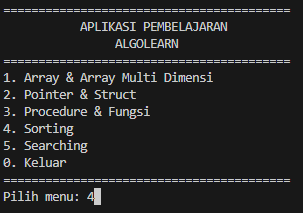
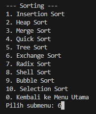
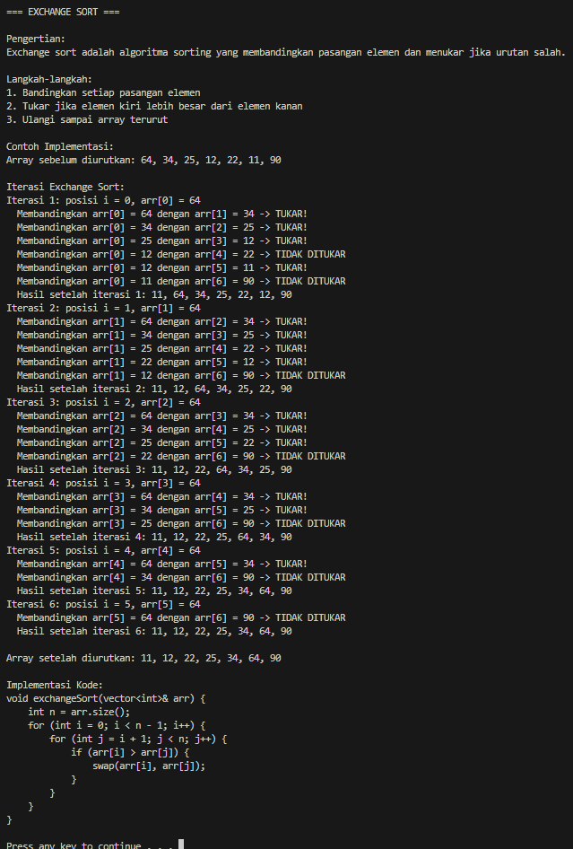

# 📘 AlgoLearn - Aplikasi Pembelajaran Algoritma dan Struktur Data

AlgoLearn adalah aplikasi berbasis command-line (CLI) 🖥️ yang dibangun menggunakan bahasa pemrograman C++. Aplikasi ini dirancang untuk membantu mahasiswa dan pemula memahami konsep-konsep dasar dan lanjut dalam algoritma dan struktur data secara interaktif dan visual. Program ini menyediakan penjelasan teori 📚, contoh implementasi 💻, dan simulasi langkah-demi-langkah dari berbagai algoritma dan struktur data populer.

## ✨ Fitur Utama

*   **Interaktif:** 🎮 Navigasi menu yang mudah untuk memilih topik yang ingin dipelajari.
*   **Komprehensif:** 🧠 Mencakup berbagai topik penting mulai dari Array dan String hingga algoritma Sorting dan Searching.
*   **Penjelasan Teori:** 📖 Setiap topik menyertakan definisi dan langkah-langkah implementasi.
*   **Contoh Kode:** 💡 Menyediakan potongan kode C++ untuk memperjelas konsep.
*   **Simulasi Langkah-demi-Langkah:** 🔁 Menampilkan proses iterasi algoritma (misalnya, proses pengurutan atau pencarian) untuk pemahaman yang lebih baik.
*   **Modular Design:** 🧩 Kode terorganisir ke dalam beberapa file header (.h) dan source (.cpp) untuk memudahkan pemeliharaan.

## 📑 Daftar Isi

1.  [Array & Array Multi Dimensi](#array--array-multi-dimensi-)
2.  [Pointer & Struct](#pointer--struct-)
3.  [Procedure & Fungsi](#procedure--fungsi-)
4.  [Sorting](#sorting-)
5.  [Searching](#searching-)
6.  [Gambar dan Poster](#gambar-dan-poster-)

## 🧭 Topik yang Dibahas

### Array & Array Multi Dimensi 📊

*   **String:** 📝 Penjelasan dan implementasi string di C++.
*   **Array Statis:** 📏 Array dengan ukuran tetap ditentukan saat kompilasi.
*   **Array Dinamis:** 📐 Array dengan ukuran ditentukan saat runtime menggunakan `new`.
*   **Array 1 Dimensi:** ↔️ Array linear dasar.
*   **Array Multi Dimensi (2 & 3 Dimensi):** 📦 Representasi data dalam bentuk tabel (matriks) atau volume.
*   **Operasi Matriks:** ➕➖✖️🔄 Penjumlahan, pengurangan, perkalian, transpose, dan invers matriks.

### Pointer & Struct 🎯

*   **Pointer:** 📍 Konsep variabel yang menyimpan alamat memori.
*   **Struct:** 🏗️ Tipe data bentukan untuk mengelompokkan variabel berbeda.
*   **Array & Struct:** 📋 Menggunakan array dari struct.
*   **Pointer & Struct:** 🧲 Mengakses anggota struct melalui pointer.
*   **Union:** 🔀 Tipe data bentukan di mana anggota berbagi lokasi memori.

### Procedure & Fungsi ⚙️

*   **Procedure (Void Function):** 🚫 Fungsi tanpa nilai kembalian.
*   **Function:** 🔄 Fungsi dengan nilai kembalian.
*   **Parameter:** 📥 Input yang diterima oleh fungsi (by value, by reference).
*   **Variabel Lokal & Global:** 🌍 Scope variabel dalam fungsi dan secara keseluruhan program.
*   **Variabel Static:** 🧘‍♂️ Variabel yang mempertahankan nilai antar pemanggilan fungsi.
*   **Fungsi Rekursif:** 🔄 Fungsi yang memanggil dirinya sendiri.

### Sorting 🔄

*   **Insertion Sort:** 📅 Menyisipkan elemen ke posisi yang benar dalam array yang sudah terurut sebagian.
*   **Heap Sort:** 🏔️ Menggunakan struktur data heap untuk pengurutan.
*   **Merge Sort:** 🔗 Algoritma divide-and-conquer yang menggabungkan bagian yang terurut.
*   **Quick Sort:** ⚡ Algoritma divide-and-conquer dengan pivot.
*   **Tree Sort:** 🌳 Menggunakan Binary Search Tree (BST).
*   **Exchange Sort:** ↔️ Membandingkan dan menukar pasangan elemen.
*   **Radix Sort:** 🔢 Mengurutkan berdasarkan digit/digit nilai.
*   **Shell Sort:** 🐚 Versi perbaikan dari insertion sort dengan gap.
*   **Bubble Sort:** 🫧 Menukar elemen berdekatan jika urutan salah.
*   **Selection Sort:** 🔍 Memilih elemen terkecil dan menukar dengan posisi pertama.

### Searching 🔍

*   **Fibonacci Search:** 🐰 Penjelasan dan implementasi Fibonacci Search.
*   **Binary Search:** 📊 Pencarian cepat pada array terurut dengan pembagian dua.
*   **Interpolation Search:** 📈 Pencarian pada array terurut dengan estimasi posisi.
*   **Sequential/Linear Search:** ➡️ Pencarian sederhana dengan memeriksa setiap elemen.

## 🚀 Cara Menjalankan Program

1.  Pastikan kamu memiliki compiler C++ (seperti GCC) yang terinstal di sistem kamu. 💻
2.  Clone atau download repositori ini ke komputer lokal. 📥
3.  Buka terminal atau command prompt dan navigasi ke direktori tempat file `main.cpp` berada. 🖥️
4.  Compile program: 🛠️
    ```bash
    g++ -o algolearn main.cpp menu.cpp array_submenu.cpp pointer_struct_submenu.cpp procedure_function_submenu.cpp sorting_submenu.cpp searching_submenu.cpp
    ```
    *(Catatan: Sesuaikan nama file source jika berbeda)*
5.  Jalankan program: ▶️
    ```bash
    ./algolearn
    ```
    *(Untuk Windows, mungkin perlu `algolearn.exe`)*

## 📁 Struktur Proyek

*   `main.cpp`: Fungsi utama dan loop menu utama. 🏠
*   `menu.h`: Fungsi-fungsi utilitas untuk UI seperti `cls()` dan `pause()`, serta menu utama. 🎛️
*   `array_submenu.h`: Implementasi dan tampilan untuk topik Array. 📊
*   `pointer_struct_submenu.h`: Implementasi dan tampilan untuk topik Pointer & Struct. 🎯
*   `procedure_function_submenu.h`: Implementasi dan tampilan untuk topik Procedure & Fungsi. ⚙️
*   `sorting_submenu.h`: Implementasi dan tampilan untuk algoritma Sorting. 🔄
*   `searching_submenu.h`: Implementasi dan tampilan untuk algoritma Searching. 🔍

## 🛠️ Teknologi yang Digunakan

*   Bahasa Pemrograman: C++ 👨‍💻
*   Library Standar C++: `<iostream>`, `<string>`, `<vector>`, dll. 📚

## 🖼️ Gambar dan Poster

Berikut adalah tampilan dari aplikasi AlgoLearn dan poster promosi proyek.

### 📽️ Poster AlgoLearn


*Poster yang menj-fitur utama AlgoLearn.* 🧠

### 📸 Contoh Tampilan Program (Screenshot)

<div align="center">


<br>
<i>Ilustrasi tampilan program saat menjelaskan dan mensimulasikan algoritma Fibonacci Search.</i> 🔁

</div>

<div align="center">


<br>
<i>Tampilan menu utama aplikasi.</i> 🏠

</div>

<div align="center">


<br>
<i>Tampilan simulasi proses sorting.</i> 🔄

</div>

---
